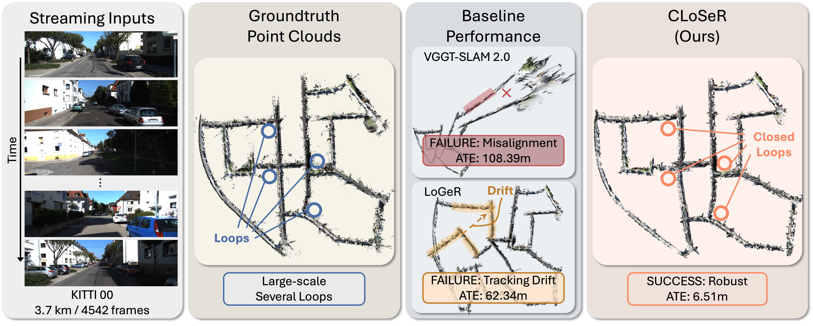

<div align="center">

# CLoSeR: Closing the Loop for Long-Context Streaming Reconstruction

[Zihan Zhu](https://zzh2000.github.io/)<sup>1\*</sup> · [Moyang Li](https://moyangli00.github.io/)<sup>1\*</sup> · [Wei Zhang](https://scholar.google.com/citations?user=EvaEv3gAAAAJ&hl=en)<sup>2</sup> · [Marc Pollefeys](https://people.inf.ethz.ch/marc.pollefeys/)<sup>1,3</sup> · [Daniel Barath](https://danini.github.io/)<sup>1</sup>

<sup>1</sup>ETH Zurich &nbsp;&nbsp; <sup>2</sup>University of Stuttgart &nbsp;&nbsp; <sup>3</sup>Microsoft

<sup>\*</sup>Equal contribution; author order is interchangeable.

**NeurIPS 2026**

<a href="https://neurips2026-closer.github.io"></a>
<a href="https://arxiv.org/abs/2610.01927"></a>



</div>

**CLoSeR** revisits loop closure for streaming reconstruction foundation models, enabling accurate, drift-free, kilometer-scale reconstruction.

## Contents
- [Installation](#installation)
- [Checkpoints](#checkpoints)
- [Datasets](#datasets)
- [Evaluation](#evaluation)
- [Visualization](#visualization)
- [Citation](#citation)
- [Acknowledgments](#acknowledgments)

## Installation

```bash
git clone https://github.com/MoyangLi00/CLoSeR.git
cd CLoSeR
conda create -n closer python=3.11
conda activate closer
pip install -r requirements.txt
```

A GPU with BF16 support (compute capability ≥ 8.0, e.g. RTX 3090/4090, A100) is required.

## Checkpoints

Download the checkpoints of LoGeR and SALAD.

```bash
mkdir -p ckpts/LoGeR ckpts/SALAD
wget -O ckpts/LoGeR/latest.pt "https://huggingface.co/Junyi42/LoGeR/resolve/main/LoGeR/latest.pt?download=true"
curl -L -o ckpts/SALAD/dino_salad.ckpt https://github.com/serizba/salad/releases/download/v1.0.0/dino_salad.ckpt
```

## Datasets

Download scripts are provided in `scripts_download/`. Data is expected under `data/`.

| Dataset | Command |
|---|---|
| KITTI Odometry | `bash scripts_download/download_kitti.sh` |
| VBR | `bash scripts_download/download_vbr.sh` |
| Oxford Spires | `python scripts_download/download_oxford_spires.py` then `python scripts_download/undistort_oxford_spires.py` |
| DROID-W | `bash scripts_download/download_droidw.sh` |

## Evaluation

Each benchmark has a runner (`scripts/run_<dataset>.sh`) and an evaluation script
(`scripts/<dataset>_traj_plot.py`). For example, on KITTI:

```bash
# 1. Run CLoSeR and save the estimated trajectories
bash scripts/run_kitti.sh --pgo --loopdetect --online_pgo --output_dir results/kitti

# 2. Compute ATE RMSE and plot the trajectories
python scripts/kitti_traj_plot.py --results_dir results/kitti/LoGeR
```

Replace `kitti` with `vbr`, `droidw` or `oxford_spires` for the other benchmarks.
Use `--seq "00 05"` to run a subset of sequences, and `bash scripts/run_kitti.sh --help`
for all options.

## Visualization

Add `--save_viser_data` to save a point-cloud bundle (every `--save_stride`-th frame):

```bash
bash scripts/run_kitti.sh --pgo --loopdetect --online_pgo \
     --save_viser_data --save_stride 10 --output_dir results/kitti
```

Then launch the interactive viewer:

```bash
python scripts/visualize_viser.py \
    --predictions results/kitti/LoGeR/viser_bundles/00/*.pt --port 8181
```

## Citation

```bibtex
@article{li2026closer,
  title   = {CLoSeR: Closing the Loop for Long-Context Streaming Reconstruction},
  author  = {Li, Moyang and Zhu, Zihan and Zhang, Wei and Pollefeys, Marc and Barath, Daniel},
  journal = {Advances in Neural Information Processing Systems},
  year    = {2026}
}
```

## Acknowledgments

Our code builds on [LoGeR](https://github.com/Junyi42/LoGeR), [SALAD](https://github.com/serizba/salad), [GTSAM](https://gtsam.org/) and [Viser](https://github.com/nerfstudio-project/viser). We thank the authors for releasing their code.